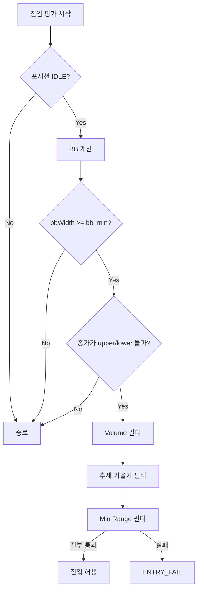

# 포지션 진입 조건 명세

> 작성 목적: 진입 로직만 코드로 재작성할 수 있을 정도의 상세 수준

---

## 목차

1. [전략 원칙](#1-전략-원칙)
2. [진입 관련 파라미터](#2-진입-관련-파라미터)
3. [진입 선행 조건](#3-진입-선행-조건)
4. [볼린저 밴드 돌파 조건](#4-볼린저-밴드-돌파-조건)
5. [추세 기울기 조건](#5-추세-기울기-조건)
6. [보조 필터](#6-보조-필터)
7. [최종 진입 판정](#7-최종-진입-판정)
8. [진입 실패 사유](#8-진입-실패-사유)

---

## 1. 전략 원칙

| 원칙 | 설명 |
|------|------|
| 횡보장 진입 금지 | BB 폭(Min Width)이 충분히 넓을 때만 진입 |

진입은 **볼린저 밴드 돌파 신호**를 트리거로 하고, **추세 기울기·거래량·캔들 크기**로 거짓 신호를 걸러낸다.

---

## 2. 진입 관련 파라미터

| 파라미터 | Config 키 | 기본값 | 용도 |
|----------|-----------|--------|------|
| BB Length | `bb_len` | 20 | 볼린저 SMA 기간 |
| BB Mult (StdDev) | `bb_mult` | 2.0 | 상·하단 밴드 폭 |
| BB Min Width % | `bb_min` | 1.25 | 횡보장 차단 (밴드 폭 하한) |
| Vol Mult | `vol_mult` | 2 | 거래량 배수 하한 |
| Vol Lookback | `vol_len` | 20 | 거래량 평균 기간 |
| Trend Len | `f_trend_len` | 8 | 추세 기울기 측정 봉 수 |
| Trend Min % | `f_trend_pct` | 0.3 | 추세 기울기 최소 크기 (%) |

---

## 3. 진입 선행 조건

| ID | 요구사항 |
|----|----------|
| REQ-GATE-001 | 해당 심볼 포지션이 `IDLE` 일 때만 진입 평가 |
| REQ-GATE-002 | 전체 동시 보유 포지션 수가 허용 한도(예: 2) 까지만 진입 |
| REQ-GATE-003 | 1분봉 최근 100개 데이터가 준비되어 있어야 함 |

**데이터**

| ID | 요구사항 |
|----|----------|
| REQ-DATA-001 | 심볼 1분봉 최근 100개 조회 |
| REQ-DATA-002 | `closes[]` 종가, `volumes[]` 거래량, `last` 현재 봉, `prev` 직전 봉 |
| REQ-DATA-003 | `price` = 현재 봉 종가, `volume` = 현재 봉 거래량 |

---

## 4. 볼린저 밴드 돌파 조건

### 4.1 밴드 계산

**입력**: `closes[]`, `bb_len`, `bb_mult`

```
basis      = SMA(closes[-bb_len:])
std        = sqrt( mean( (x - basis)^2 ) )    // 모집단 표준편차
upper      = basis + bb_mult * std
lower      = basis - bb_mult * std
bbWidth(%) = (2 * bb_mult * std / basis) * 100
```

| ID | 요구사항 |
|----|----------|
| REQ-BB-001 | `bbWidthOk = (bb_min == 0) OR (bbWidth >= bb_min)` |
| REQ-BB-002 | `bbWidthOk == false` 이면 돌파 신호를 발생시키지 않음 (**횡보장 진입 금지**) |

### 4.2 돌파 신호 (BREAKOUT)

| 조건 | Side | Signal |
|------|------|--------|
| `price > upper` AND `bbWidthOk` | LONG | BREAKOUT |
| `price < lower` AND `bbWidthOk` | SHORT | BREAKOUT |

| ID | 요구사항 |
|----|----------|
| REQ-BO-001 | **종가 기준** 돌파 — 현재 봉 종가가 upper/lower 바깥 |
| REQ-BO-002 | 직전 봉 교차(crossover)는 **필수 아님** — 밴드 밖에 머물면 매 루프 재평가 |
| REQ-BO-003 | LONG·SHORT 중 한 방향만 선택 (동시 충족 시 구현에서 우선순위 정의) |
| REQ-BO-004 | `bbWidthOk` 없이는 upper/lower 돌파만으로는 진입 불가 |

### 4.3 횡보 vs 돌파 판단 요약

```
[횡보]  bbWidth < bb_min  →  신호 없음 (진입 차단)
[돌파]  bbWidth >= bb_min AND price > upper  →  LONG 후보
[돌파]  bbWidth >= bb_min AND price < lower  →  SHORT 후보
```

---

## 5. 추세 기울기 조건

돌파 방향과 **같은 방향으로 기울어진 추세**인지 확인한다.  
최근 `f_trend_len`개 봉의 종가 변화로 **기울기 크기·방향·일관성**을 검사한다.

### 5.1 입력

```
closes = 최근 (f_trend_len + 1)개 종가
side   = BREAKOUT으로 결정된 LONG 또는 SHORT
```

`f_trend_len == 0` 이면 추세 기울기 필터는 **통과** (비활성).

### 5.2 기울기 계산

```
first     = closes[0]
last      = closes[-1]
slopePct  = ((last - first) / first) * 100        // 기울기 크기 (%)

direction = UP   (last > first)
          | DOWN (last < first)
          | FLAT (last == first)

deltas[i]       = closes[i] - closes[i-1]         // 봉별 기울기
sameDirRatio    = (direction과 같은 부호 delta 수) / (delta 총 개수)
```

### 5.3 통과 조건

| ID | 조건 | LONG | SHORT |
|----|------|------|-------|
| REQ-SLOPE-001 | 방향 일치 | `direction == UP` | `direction == DOWN` |
| REQ-SLOPE-002 | 기울기 크기 | `\|slopePct\| >= f_trend_pct` | `\|slopePct\| >= f_trend_pct` |
| REQ-SLOPE-003 | 기울기 일관성 | `sameDirRatio >= 0.6` | `sameDirRatio >= 0.6` |

```
trendOk = okDir AND okPct AND okMajor
```

| ID | 요구사항 |
|----|----------|
| REQ-SLOPE-004 | LONG 돌파 시 하락 기울기(`DOWN`)이면 진입 거부 |
| REQ-SLOPE-005 | SHORT 돌파 시 상승 기울기(`UP`)이면 진입 거부 |
| REQ-SLOPE-006 | 기울기는 크지만 봉 방향이 뒤섞인 경우(`sameDirRatio < 0.6`) 진입 거부 |
| REQ-SLOPE-007 | API/데이터 오류 시 fail-open(통과) 처리 가능 — 구현 시 명시 |

### 5.4 해석 예시

| 상황 | slopePct | sameDirRatio | LONG 돌파 |
|------|----------|--------------|-----------|
| 완만한 횡보 | 0.1% | 0.5 | 거부 (크기·일관성 미달) |
| 급등 추세 | 0.8% | 0.875 | 통과 |
| 지그재그 | 0.5% | 0.4 | 거부 (일관성 미달) |

---

## 6. 보조 필터

돌파·추세 기울기 외에 아래 조건을 **AND**로 적용한다.

### 6.1 거래량 (Volume)

> **순간적/과격한 돌파(거래량 없는 돌파) 차단**

```
prevVolumes = volumes[-(vol_len+1) : -1]    // 현재 봉 제외
avgVolume   = mean(prevVolumes)
volumeRatio = volume / avgVolume
volumeOk    = (avgVolume == 0) OR (volumeRatio >= vol_mult)
```

| ID | 요구사항 |
|----|----------|
| REQ-VOL-001 | 현재 봉 거래량이 직전 `vol_len`봉 평균의 `vol_mult`배 이상 |
| REQ-VOL-002 | `volumeRatio < vol_mult` 이면 돌파 신호가 있어도 진입 거부 |

### 6.2 캔들 변동폭 (Min Range)

```
candleRange = |high - low|
rangePct    = (candleRange / price) * 100
rangeOk     = (min_range_pct == 0) OR (rangePct >= min_range_pct)
```

| ID | 요구사항 |
|----|----------|
| REQ-RNG-001 | 현재 봉 변동폭이 `min_range_pct` 미만이면 진입 거부 |
| REQ-RNG-002 | 너무 작은 봉(미세 변동)에서의 거짓 돌파 방지 |

---

## 7. 최종 진입 판정

### 7.1 의사코드

```python
def can_enter(symbol, settings):
    candles = fetch_klines(symbol, limit=100)

    bb = compute_bollinger(candles.closes, settings.bb_len, settings.bb_mult)
    if not bb_width_ok(bb, settings.bb_min):
        return False, "BB_WIDTH"

    side, signal = detect_breakout(candles.last.close, bb)
    if side is None:
        return False, None

    volume_ok = check_volume(candles, settings)
    trend_ok  = check_trend_slope(candles.closes, side, settings)
    range_ok  = check_range(candles.last, settings)

    if volume_ok and trend_ok and range_ok:
        return True, side
    return False, failed_reasons(volume_ok, trend_ok, range_ok)
```

### 7.2 통과 조건 (한 줄)

```
bbWidthOk
AND (price > upper OR price < lower)   // BREAKOUT
AND volumeOk
AND trendOk                            // 추세 기울기
AND rangeOk
→ 진입 허용
```

### 7.3 흐름도



---

## 8. 진입 실패 사유

| 코드 | 의미 |
|------|------|
| `BB_WIDTH` | 밴드 폭이 `bb_min` 미만 — 횡보장 |
| `VOLUME` | `volumeRatio < vol_mult` — 거래량 부족 |
| `TREND` | 추세 기울기 방향·크기·일관성 미달 |
| `RANGE` | 현재 봉 변동폭 % 미달 |

---

## 부록: 진입 조건 요약

| 단계 | 내용 | 차단 대상 |
|------|------|-----------|
| 1. BB Min Width | 밴드 폭 ≥ `bb_min` | 횡보장 |
| 2. BB Breakout | 종가 > upper (LONG) 또는 < lower (SHORT) | 방향 없음 |
| 3. Volume | 현재 거래량 ≥ 평균 × `vol_mult` | 거래량 없는 돌파 |
| 4. 추세 기울기 | 방향 일치 + `\|slopePct\|` ≥ `f_trend_pct` + 60% 동조 | 역추세·약한 추세 |
| 5. Min Range | `(high-low)/close` ≥ `min_range_pct` | 미세 봉 돌파 |

> **진입 = BB 돌파(BREAKOUT) + 추세 기울기 + 거래량 + 캔들 변동폭**
